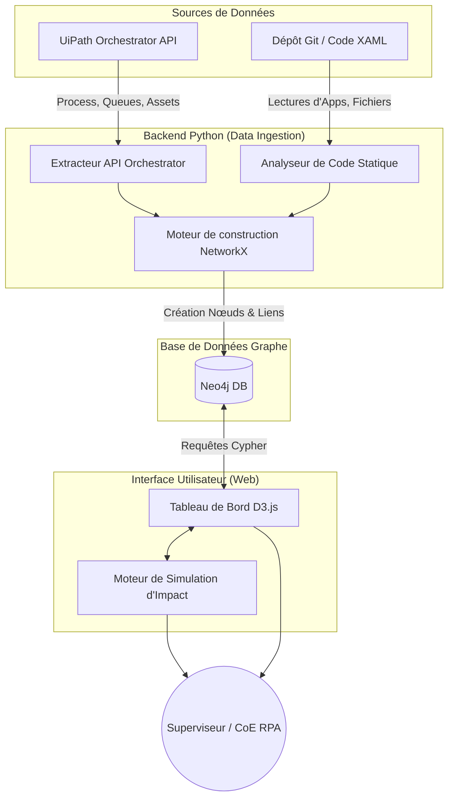

# Dossier de Spécifications Techniques : FR MKT COMPLETION OF EDITO FOR WEBSHOP VISIBILITY
**Généré le :** 11/12/2025 11:30

---
**Dossier de Spécifications Techniques (DST)**
*Projet : **FR MKT COMPLETION OF EDITO FOR WEBSHOP VISIBILITY***
*Version : 1.0*
*Date : [JJ/MM/AAAA]*
*Rédigé par : [Nom de l'Architecte RPA]*
---

---

## **0. 📝 Résumé Exécutif**
### **Synthèse Métier**
Ce processus RPA vise à **automatiser la complétion des informations éditoriales (Edito)** dans un outil dédié (probablement un CMS ou une plateforme de gestion de contenu marketing) pour **garantir la visibilité des produits sur le Webshop**.

**Objectifs clés** :
- **Centralisation** : Récupération des données éditoriales manquantes (ex : descriptions, images, métadonnées) depuis une source (Excel, API, ou base de données).
- **Intégration** : Connexion à l'outil **Edito** et au **Media Plan** pour mise à jour des contenus.
- **Traçabilité** : Envoi de rapports d'exécution (succès/échecs) par email aux parties prenantes.
- **Robustesse** : Gestion des erreurs (ex : échecs de login, données manquantes) avec relances ou notifications.

**Bénéfices attendus** :
✅ Réduction des erreurs manuelles dans la saisie des éditos.
✅ Gain de temps pour les équipes marketing (focus sur la stratégie plutôt que la saisie).
✅ Amélioration de la visibilité des produits en ligne via des contenus complets et cohérents.

---

## **1. 🆔 Fiche d'Identité**
| **Champ**               | **Valeur**                                                                 |
|-------------------------|---------------------------------------------------------------------------|
| **Nom du Projet**       | FR MKT COMPLETION OF EDITO FOR WEBSHOP VISIBILITY                        |
| **Type de Processus**   | **Attended/Unattended** : Unattended (exécution planifiée en arrière-plan). |
| **Langage/Plateforme**  | UiPath (Studio 2024.10+)                                                   |
| **Dependencies**        |                                                                           |
| - **System.Xml**        | 4.3.1 (Gestion des fichiers XML si besoin)                                |
| - **UiPath.Callout**    | 25.10.0 (Activités de notification visuelle)                              |
| - **UiPath.Excel**      | 3.3.1 (Lecture/écriture de fichiers Excel pour les données d'entrée)      |
| - **UiPath.MS Office365** | 2.7.22 (Envoi d'emails via Outlook 365)                                   |
| - **UiPath.System**     | 24.10.5 (Activités système de base)                                       |
| - **UiPath.Testing**    | 24.10.1 (Tests unitaires si implémentés)                                  |
| - **UiPath.UIAutomation** | 24.10.3 (Automatisation des interfaces Edito/Media Plan)                 |

---

## **2. 🏗 Architecture Globale**
### **Flux Principal**
Le processus suit une **architecture modulaire** avec un **workflow principal (`Main.xaml`)** orchestrant les sous-processus :

1. **Initialisation** (`LoadStep.xaml`) :
   - Chargement des **données d'entrée** (ex : liste des produits à compléter depuis un Excel ou une API).
   - Vérification des prérequis (fichiers disponibles, accès aux outils).

2. **Connexion aux Plateformes** :
   - **`LoginToEdito.xaml`** : Authentification à l'outil Edito (probablement via UI ou API).
   - **`LoginToMediaPlan.xaml`** : Connexion au Media Plan pour croiser les données (ex : dates de campagne).

3. **Traitement des Données** :
   - Pour chaque produit :
     - Récupération des **champs manquants** (ex : description, images).
     - Mise à jour dans Edito via **UI Automation** ou **API**.
     - Validation des modifications (ex : vérification visuelle ou retour API).

4. **Gestion des Erreurs** (`GlobalError.xaml`) :
   - Capture des exceptions (ex : timeout, données invalides).
   - **Relance automatique** (si possible) ou **sortie graceuse** avec logging.

5. **Rapport & Notification** (`SendMailErrorSuccess.xaml`) :
   - Génération d'un **rapport d'exécution** (succès/échecs).
   - Envoi par email aux destinataires configurés (via Office365).

6. **Tests** (`TC_LoginToEdito.xaml`) :
   - Vérification de la connexion à Edito (cas de test dédié).

### **Schéma de Flux**

---

## **3. ⚙️ Configuration**
### **Assets/Queues**
| **Type**       | **Nom**               | **Usage**                                                                 | **Valeur Exemple**                     |
|----------------|------------------------|---------------------------------------------------------------------------|----------------------------------------|
| **Asset**      | `Edito_Credentials`   | Stockage sécurisé des identifiants pour Edito (username/password).       | `{"user": "mkt_bot", "pwd": "***"}`    |
| **Asset**      | `MediaPlan_Credentials` | Identifiants pour Media Plan.                                            | `{"user": "media_bot", "pwd": "***"}`  |
| **Asset**      | `Email_Recipients`    | Liste des destinataires pour les rapports (format JSON ou CSV).         | `["marketing@entreprise.com"]`         |
| **Queue**      | *Non utilisé*         | Pas de file d'attente (traitement direct des données en mémoire/Excel).   | -                                      |

### **Paramètres Globaux**
- **Chemin du fichier d'entrée** : `\\Server\Marketing\Edito\Input\Products_To_Complete.xlsx`
- **Délai d'attente UI** : 30 secondes (pour les chargements de pages).
- **Nombre de relances max** : 3 (en cas d'échec de connexion).

---

## **4. 📥 Inputs/Outputs**
### **Inputs**
| **Source**       | **Format** | **Description**                                                                 | **Exemple**                          |
|------------------|------------|---------------------------------------------------------------------------------|--------------------------------------|
| Fichier Excel    | `.xlsx`    | Liste des produits avec champs à compléter (ID, description manquante, etc.). | `ProductID, MissingField, Priority`  |
| Assets           | JSON       | Credentials pour Edito/Media Plan.                                             | `{"user": "...", "pwd": "..."}`      |

### **Outputs**
| **Destination**  | **Format** | **Description**                                                                 | **Exemple**                          |
|------------------|------------|---------------------------------------------------------------------------------|--------------------------------------|
| Email (Office365)| Corps HTML | Rapport d'exécution avec stats (succès/échecs) et logs.                       | `10/12 produits mis à jour`         |
| Logs             | `.txt`     | Fichier de logs détaillé (chemin : `\\Server\Logs\Edito_Completion_[Date].log`). | `ERROR: Timeout on ProductID 123`   |

---

## **5. 🔧 Gestion des Erreurs**
### **Stratégie**
- **Erreurs critiques** (ex : échec de login) :
  - **Arrêt du processus** + notification email immédiate.
  - Logs détaillés avec screenshot (via `UiPath.Callout`).
- **Erreurs non critiques** (ex : champ manquant pour 1 produit) :
  - **Continuation du flux** avec marquage du produit en échec.
  - Inclusion dans le rapport final.

### **Workflows Dédiés**
- **`GlobalError.xaml`** :
  - Centralise la gestion des exceptions (try/catch globaux).
  - Génère des **codes d'erreur standardisés** (ex : `ERR_LOGIN_001` pour échec de connexion).

### **Exemples de Scénarios**
| **Scénario**               | **Action**                                                                 |
|-----------------------------|---------------------------------------------------------------------------|
| Échec de connexion à Edito  | Relance 3 fois → si échec, email + arrêt.                                |
| Données manquantes dans Excel| Ignorer la ligne + logger l'erreur.                                       |
| Timeout sur une page UI     | Rafraîchir la page 2 fois → si échec, marquer comme "À traiter manuellement". |

---

## **6. 🚀 Guide de Déploiement**
### **Prérequis**
- **Environnement** :
  - UiPath Robot **2024.10+** (version alignée avec les dépendances).
  - Accès aux outils **Edito** et **Media Plan** (URLs whitelistées si besoin).
  - Compte Office365 configuré pour l'envoi d'emails.
- **Fichiers** :
  - Dossier partagé accessible en lecture/écriture (`\\Server\Marketing\Edito\`).

### **Étapes de Déploiement**
1. **Importer le processus** dans UiPath Orchestrator :
   - Créer un **nouveau processus** avec les dépendances listées.
   - Lier les **Assets** (`Edito_Credentials`, etc.).
2. **Configurer les déclencheurs** :
   - **Planification** : Exécution quotidienne à 2h00 (hors heures de pointe).
   - **Déclenchement manuel** : Optionnel pour les tests.
3. **Tester en environnement de staging** :
   - Vérifier la connexion aux outils cibles.
   - Valider le format des emails de rapport.
4. **Basculer en production** :
   - Activer le processus dans Orchestrator.
   - Monitorer les premiers runs via les logs.

### **Rollback**
- En cas d'échec majeur :
  - Désactiver le processus dans Orchestrator.
  - Restaurer les données depuis une sauvegarde (si modifications destructrices).

---

## **7. 🧪 Tests**
### **Tests Implémentés**
| **Workflow**            | **Type de Test**       | **Description**                                                                 |
|-------------------------|------------------------|---------------------------------------------------------------------------------|
| `TC_LoginToEdito.xaml` | **Test Unitaire**      | Vérifie la connexion à Edito avec des credentials valides/invalides.

---
## 8. 📂 Dictionnaire des Workflows

| Nom du Workflow | Type | Résumé Technique |
| :--- | :--- | :--- |
| `GlobalError.xaml` | PROD | **Ce workflow implémente un gestionnaire d'exceptions global utilisant une activité *Log Message* pour journaliser les erreurs et un *Choose* (ou *Flow Decision*) pour déterminer le comportement suivant (ex. relancer, arrêter ou ignorer l'erreur) en fonction du type/critère d'exception capturé.** |
| `LoadStep.xaml` | PROD | Ce workflow vérifie l'état de l'application en détectant l'élément "Loading…" via *NCheckState*, déclenche un délai de 5 secondes si la cible est trouvée (*IfExists*), ou poursuit l'exécution si elle est absente (*IfNotExists*), avec traçabilité via *LogMessage*. |
| `LoginToEdito.xaml` | PROD | Ce workflow gère l'authentification à la plateforme *Edito* via une séquence sécurisée incluant la récupération des identifiants robot (GetRobotCredential), l'ouverture de l'application (NApplicationCard), et un bloc *Try-Catch* pour journaliser les erreurs via *LogMessage*. |
| `LoginToMediaPlan.xaml` | PROD | Ce workflow automatise la connexion à *MediaPlanHQ* via Chrome en vérifiant l'état de l'application, en récupérant les identifiants sécurisés (*Get Credential for MediaPlan-AFP*), puis en exécutant une séquence de login et de navigation vers le module *Comptabilité* via des activités *NApplicationCard* et des validations d'état (*NCheckState*), avec traçabilité via *LogMessage*. |
| `Main.xaml` | PROD | Ce workflow principal orchestré via une séquence *Séquence* initialise le processus en désactivant des activités commentées (*CommentOut*), enregistre un message de log (*LogMessage*), puis déclenche une séquence de connexion à l'application *Edito* via le composant personnalisé *NApplicationCard* (incluant navigation et authentification). |
| `SendMailErrorSuccess.xaml` | PROD | Ce workflow envoie un email d'alerte en cas d'échec du clic sur le menu "Merchandising", utilisant une activité **Send SMTP Mail** conditionnée par une gestion d'erreur (*Try-Catch* ou *If* implicite) pour notifier l'échec de l'interaction UI. |
| `TC_LoginToEdito.xaml` | PROD | Ce workflow implémente un test case (TC) structuré en *Given-When-Then* qui invoque le sous-workflow *LoginToEdito.xaml* (via **InvokeWorkflowFile**) pour exécuter une authentification sur l'application Edito, puis valide le résultat via une **Verify Expression**, avec des traces générées par **LogMessage** pour le suivi. |
