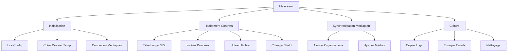

# Dossier de Spécifications Techniques : FR MKT Comercial Cooperation Contract V2
**Date :** 11/12/2025 11:51

---
**Dossier de Spécifications Techniques (DST)**
*Projet : **FR MKT Commercial Cooperation Contract V2***
*Version : 1.0*
*Date : [JJ/MM/AAAA]*
*Rédigé par : [Nom de l'Architecte RPA]*
---

---

## **0. 📝 Résumé Exécutif (Synthèse Métier)**
### **Contexte & Objectifs**
Le processus **"FR MKT Commercial Cooperation Contract V2"** automatise la gestion des **contrats de coopération commerciale** au sein de l'écosystème marketing français. Il couvre :
- **L'extraction et le traitement** de données contractuelles (fichiers 577, répertoires fournisseurs, fichiers comptables).
- **La synchronisation** avec des systèmes tiers (ex: **Mediaplan**) pour la création/mise à jour de contrats, médias, formats, et plans médias.
- **La gestion des statuts** (téléchargement, modification, upload).
- **La traçabilité** via des logs et l'envoi d'emails de notification (ex: absence de contrats, alertes fournisseurs).
- **La maintenance** des dossiers temporaires et assistants.

### **Périmètre Fonctionnel**
| **Domaine**               | **Activités Clés**                                                                 |
|---------------------------|-----------------------------------------------------------------------------------|
| **Gestion des Contrats**  | Téléchargement, modification de statut, upload, extraction de données (577).     |
| **Intégration Systèmes**  | Connexion à Mediaplan, ajout d'organisations/médias/formats/plans.               |
| **Reporting & Alertes**   | Génération de logs, envoi d'emails (fournisseurs, contrats manquants).           |
| **Maintenance**           | Création/suppression de dossiers temporaires, réinitialisation des filtres.      |

### **Bénéfices Attendus**
- **Réduction des erreurs** : Automatisation des tâches répétitives (ex: saisie manuelle des contrats).
- **Gain de temps** : Traitement en masse des fichiers 577 et synchronisation avec Mediaplan.
- **Traçabilité** : Centralisation des logs et notifications proactives.
- **Scalabilité** : Modularité pour ajouter de nouveaux cas d'usage (ex: nouveaux statuts de contrat).

---

## **1. 🆔 Fiche d'Identité**
| **Champ**               | **Valeur**                                                                 |
|-------------------------|---------------------------------------------------------------------------|
| **Nom du Projet**       | FR MKT Commercial Cooperation Contract V2                                |
| **Type de Processus**   | **Blank Process** (Orchestration de workflows modulaires)                 |
| **Langage**            | UiPath (Studio 2023.10+)                                                   |
| **Dependencies**        |                                                                           |
| - **UI Automation**     | `UiPath.UIAutomation.Activities` **[25.10.19]**                          |
| - **Excel**             | `UiPath.Excel.Activities` **[3.2.1]**                                    |
| - **Email**             | `UiPath.Mail.Activities` **[2.4.10]**, `UiPath.MicrosoftOffice365` **[3.4.10]** |
| - **Système**           | `UiPath.System.Activities` **[25.10.2]**                                 |
| - **Testing**           | `UiPath.Testing.Activities` **[25.10.0]**                                |
| - **Librairie UI**      | `Application.UI.Library` **[1.0.1-alpha.25]** (Custom)                   |

---

## **2. 🏗 Architecture Globale**
### **Flux Principal (Main.xaml)**
Le processus suit une **logique séquentielle modulaire** avec des sous-workflows spécialisés, orchestrés par :
1. **Initialisation** :
   - `Read Configuration file.xaml` → Charge les paramètres (chemins, crédentials, règles métier).
   - `Create Temporary Folder.xaml` → Prépare l'environnement de travail.
   - `Mediaplan Connection.xaml` → Établit la connexion au système tiers.

2. **Traitement des Contrats** :
   - **Cas 1 : Téléchargement et Insertion de Données**
     `Download 577.xaml` → `Insert Data 577.xaml` → `Upload 577 file.xaml`.
   - **Cas 2 : Gestion des Statuts**
     `Select contracts statuts.xaml` → `Change contract status.xaml`.
   - **Cas 3 : Extraction de Données Comptables**
     `Download accounting file.xaml` → `Download Repertoire Fournisseur.xaml`.

3. **Synchronisation avec Mediaplan** :
   - `Adding organizations.xaml` → `Adding Medias.xaml` → `Adding formats.xaml` → `Adding media plans.xaml`.
   - **Gestion des Filtres** : `Reset filters.xaml` → `Set dates.xaml` → `Uncheck current assistant.xaml`.

4. **Clôture & Nettoyage** :
   - `Copy log file.xaml` → `Read logs.xaml` → `Logout.xaml` → `Delete Temporary folder.xaml`.
   - **Notifications** : `Sending Email no contracts.xaml` ou `Sending Email Suppliers.xaml`.

### **Pattern d'Architecture**
- **Modularité** : Chaque tâche est isolée dans un workflow dédié (ex: `Case_*` pour les sous-cas).
- **Gestion des Erreurs** : Centralisée via `GlobalHandler.xaml` (try/catch globaux + logs).
- **UI Resilience** : `UIElementCheck.xaml` vérifie la disponibilité des éléments avant interaction.

### **Diagramme de Flux Simplifié**


---

## **3. ⚙️ Configuration**
### **Assets Utilisés**
| **Type**         | **Nom**                     | **Description**                                  | **Exemple de Valeur**               |
|------------------|-----------------------------|------------------------------------------------|-------------------------------------|
| **Credential**   | `Mediaplan_Credentials`     | Identifiants pour la connexion à Mediaplan.     | `{"Username": "user", "Password": "***"}` |
| **Config File**  | `ProcessConfig.json`        | Paramètres globaux (chemins, timeouts).         | `{"TempPath": "C:\\Temp", "Timeout": 30}` |
| **Queue**        | `ContractProcessingQueue`    | Files d'attente pour les contrats à traiter.   | *Non détectée explicitement*        |

### **Variables Globales Clés**
| **Nom**               | **Type**       | **Usage**                                  |
|-----------------------|----------------|--------------------------------------------|
| `in_ContractID`       | String         | ID du contrat en cours de traitement.      |
| `out_LogPath`         | String         | Chemin du fichier de logs généré.          |
| `in_DateRange`        | DateTime[]     | Période pour les filtres Mediaplan.        |
| `out_EmailStatus`     | Boolean        | Statut de l'envoi des notifications.       |

---

## **4. 📥 Inputs/Outputs Globaux**
### **Inputs (Données d'Entrée)**
| **Source**            | **Format**       | **Description**                                  | **Exemple**                          |
|-----------------------|------------------|------------------------------------------------|--------------------------------------|
| **Fichier 577**       | Excel (.xlsx)    | Données contractuelles brutes.                | `577_202405.xlsx`                    |
| **Répertoire Fournisseur** | CSV (.csv)   | Liste des fournisseurs actifs.                | `Suppliers_2024.csv`                 |
| **Fichier de Config** | JSON             | Paramètres du processus.                       | `{"MaxRetries": 3, "LogLevel": "Info"}` |
| **Mediaplan UI**      | UI Elements      | Données saisies manuellement (ex: statuts).   | *Sélection dans dropdown*            |

### **Outputs (Livrables)**
| **Destination**       | **Format**       | **Description**                                  | **Exemple**                          |
|-----------------------|------------------|------------------------------------------------|--------------------------------------|
| **Fichier Log**       | TXT (.log)        | Traçabilité des actions et erreurs.            | `20240520_ContractLogs.log`         |
| **Email Notification** | Email (SMTP/O365) | Alertes aux parties prenantes.                | *Objet: "Aucun contrat trouvé pour [Client]"* |
| **Fichier 577 Traité** | Excel (.xlsx)    | Données enrichies et validées.                | `577_Processed_202405.xlsx`          |
| **Dossier Assistant**  | Folder           | Structure pour les contrats en cours.         | `\\Server\Assistants\2024\ClientX`   |

---

## **5. 🔧 Gestion des Erreurs**
### **Stratégie Globale**
- **Centralisation** : `GlobalHandler.xaml` intercept les exceptions via un **Try-Catch global**.
- **Logs Structurés** :
  - Niveau **Info** : Actions réussies (ex: "Fichier 577 téléchargé").
  - Niveau **Error** : Échecs critiques (ex: "Échec connexion Mediaplan").
  - Niveau **Debug** : Détails techniques (ex: "Timeout sur élément UI 'BtnSubmit'").
- **Relance Automatique** : 3 tentatives pour les erreurs temporaires (ex: réseau).

### **Erreurs Spécifiques & Traitements**
| **Scenario**                          | **Erreur Attendue**               | **Action Corrective**                          |
|---------------------------------------|------------------------------------|-----------------------------------------------|
| Échec connexion Mediaplan             | `LoginFailedException`             | Relance + email à l'administrateur.           |
| Fichier 577 corrompu                  | `ExcelCorruptException`            | Téléchargement nouveau fichier + log.          |
| Élément UI introuvable                | `SelectorNotFoundException`        | Utilisation de `UIElementCheck.xaml` pour vérification.

---
## 8. 📂 Annexe : Dictionnaire des Workflows

| Nom du Workflow | Type | Résumé Technique |
| :--- | :--- | :--- |
| `Adding Medias.xaml` | PROD | Ce workflow automatise l'ajout de médias dans une application via une séquence structurée incluant la sélection des organisations (filtres "Toutes les organisations" et "Tous"), la désactivation des entrées non pertinentes, puis une itération sur un *DataTable* d'organisations pour rechercher et sélectionner chaque entrée via une barre de recherche, avec gestion des états de chargement (*Loading Circle*) après chaque interaction. |
| `Adding formats.xaml` | PROD | Ce workflow automatise la sélection et l'application de formats dans un outil Mediaplan en activant le bouton des formats, en sélectionnant "Tous les formats", puis en itérant sur une datatable pour rechercher et cliquer sur chaque nom de format tout en gérant les états de chargement via des invocations de *Loading Circle*. |
| `Adding media plans.xaml` | PROD | Ce workflow automatise l'ajout de plans médias dans MediaplanHQ en enchaînant une réinitialisation des filtres (clic sur *"Aucun"*), une sélection globale (*"Tous"*), une gestion des états de chargement (via *Invoke Loading Circle*), et une validation finale avec récupération du texte du plan média, le tout encapsulé dans des étapes de vérification de cibles (*NClick.Target*) et de journalisation (*LogMessage*). |
| `Adding organizations.xaml` | PROD | Ce workflow automatise l'ajout d'organisations dans Mediaplan en activant le bouton dédié, sélectionnant "Toutes les organisations", puis "Tous", avant d'itérer sur un *DataTable* pour rechercher et sélectionner chaque organisation via une barre de recherche, avec gestion des états de chargement (*Loading Circle*) et désactivation finale du panneau. |
| `Case_CreateAssistantFolder.xaml` | PROD |  |
| `Case_CreateTemporaryFolder.xaml` | PROD | Ce workflow orchestré en *Given-When-Then* invoque un sous-processus (`TC_CreateTemporaryFolder`) pour créer un dossier temporaire via des arguments paramétrés, puis supprime ce dossier via **DeleteFolderX** avant de valider l’exécution par une vérification d’expression en phase *Then*. |
| `Case_DeleteTemporaryFolder.xaml` | PROD | Ce workflow orchestré en *Test Case* (TC) gère un scénario BDD (*Given-When-Then*) où il crée un dossier temporaire via **CreateDirectory**, invoque un sous-workflow de suppression (**InvokeWorkflowFile** avec arguments paramétrés), puis valide le résultat via **Verify Expression** pour confirmer la suppression effective. |
| `Case_Download577.xaml` | PROD | Ce workflow orchestré en *Given-When-Then* crée un dossier temporaire via **CreateDirectory**, déclenche un sous-processus de téléchargement (*InvokeWorkflowFile* avec arguments configurés), valide une condition post-exécution (*Verify Expression*), puis nettoie le répertoire temporaire via **DeleteFolderX** pour garantir l’absence de résidus. |
| `Case_MediaplanConnection.xaml` | PROD |  |
| `Case_ReadLogs.xaml` | PROD | Ce workflow orchestré en *Given-When-Then* initialise un dossier temporaire, copie les fichiers logs sources, invoque un sous-workflow dédié à leur analyse (`ReadLogs.xaml`), supprime le répertoire temporaire en post-traitement, puis valide une condition finale via *Verify Expression* pour assurer la conformité du processus. |
| `Case_ResetFilters.xaml` | PROD | Ce workflow orchestré en **BDD (Given/When/Then)** invoque séquentiellement des sous-workflows pour réinitialiser les filtres dans l'interface *Mediaplan*, en ciblant l'onglet *Comptabilité* via un clic automatisé (`NClick` sur `NApplicationCard.Body`), puis valide le résultat via une expression de vérification (`S_FilesNumber`) après déconnexion. |
| `Case_SetDates.xaml` | PROD | Ce workflow orchestré en *Given-When-Then* invoque séquentiellement des sous-processus (connexion Mediaplan, assignation de dates factices via *MultipleAssign*, navigation vers l'onglet "Comptabilité"), valide la cible via *Verification target*, exécute la logique métier *Set Dates*, puis déclenche la déconnexion (*Logout*) avant une validation finale par *Verify Expression*. |
| `Case_UIElementCheck.xaml` | PROD | Ce workflow orchestré en *Case* invoque séquentiellement des sous-processus (connexion *Mediaplan*, vérification d’un *UIElement*, déconnexion) et valide un résultat booléen en phase *Then* via une *Verify Expression*, structurant ainsi un test BDD (Given/When/Then) avec passage d’arguments dynamiques. |
| `Change contract status.xaml` | PROD | Ce workflow orchestre le changement de statut des contrats via MediplanHQ en invoquant d’abord une lecture des logs, vérifiant l’existence des contrats éligibles, puis, si nécessaire, sélectionnant tous les contrats, appliquant le statut *"Contrat envoyé"* (commenté en développement), sauvegardant les modifications, et enregistrant les actions dans un fichier comptable avant de gérer un état de chargement via un *Loading Circle*. |
| `Contract management.xaml` | PROD | Ce workflow orchestre la gestion des contrats en invoquant des sous-processus pour lire les logs, traiter les fichiers ZIP/PDF des fournisseurs via des boucles **ForEachFileX**, envoyer des emails conditionnels (aux fournisseurs ou assistants selon la disponibilité des contacts), et gérer les cas de logs existants ou d'emails déjà envoyés, avec des étapes de journalisation (**LogMessage**) et des sections commentées pour tests. |
| `Copy log file.xaml` | PROD | Ce workflow vérifie l'existence d'un fichier de log via *FileExistsX*, le copie dans un dossier de téléchargement avec *CopyFile* si présent, et génère un message de log (*LogMessage*) en cas d'absence ou de succès, structuré par une séquence conditionnelle implicite. |
| `Create Assistant folder.xaml` | PROD | Ce workflow vérifie l'existence d'un dossier via **FolderExistsX**, le crée conditionnellement avec **CreateDirectory** si absent, et journalise l'action via **LogMessage** dans une structure séquentielle avec branche conditionnelle *If-Then-Else*.``` |
| `Create Temporary Folder.xaml` | PROD | Ce workflow vérifie l'existence d'un dossier temporaire via **FolderExistsX**, le crée conditionnellement avec **CreateDirectory** si absent, et journalise l'action via **LogMessage** pour assurer la traçabilité. |
| `Delete Temporary folder.xaml` | PROD | Ce workflow vérifie l'existence d'un dossier temporaire via **FolderExistsX**, le supprime conditionnellement avec **DeleteFolderX** si présent, et journalise l'action via **LogMessage**, structuré en une séquence logique avec une condition **If** pour gérer les deux cas (existence/inexistence). |
| `Download 577.xaml` | PROD | Ce workflow implémente une logique de téléchargement conditionnel du fichier "577" via une **RetryScope** (3 tentatives par défaut), incluant une vérification d'existence préalable, un téléchargement forcé si absent, une fermeture d'instances Excel actives via *Kill Process*, et une validation finale par un *Invoke Code* retournant un booléen pour confirmer le succès, avec des activités commentées (TEST) ignorées en production. |
| `Download Contract.xaml` | PROD | Ce workflow orchestre le téléchargement d'un contrat via Mediaplan HQ en vérifiant d'abord si le contrat existe déjà (via un log), puis en gérant deux scénarios : soit un retour immédiat si le contrat est déjà traité, soit un processus complet incluant la sélection globale des éléments (avec vérification de la checkbox "Select All"), la création d'un dossier assistant, le téléchargement du fichier comptable, la génération du contrat via des clics ciblés ("Générer"/"Go"), et enfin le déplacement du fichier téléchargé, le tout encadré par des étapes de logging et de gestion des états de chargement (Loading Circle). |
| `Download Repertoire Fournisseur.xaml` | PROD | Ce workflow vérifie l'existence du fichier *"Repertoire fournisseur"* via **FileExistsX**, le télécharge conditionnellement dans une **RetryScope** (avec 3 tentatives par défaut) en cas d'absence, exécute un **InvokeCode** pour valider un booléen de succès, puis charge les données dans un *DataTable* via **Read Range** pour traitement ultérieur. |
| `Download accounting file.xaml` | PROD | Ce workflow orchestré via **InvokeWorkflowFile** gère le téléchargement d'un fichier comptable en vérifiant d'abord son existence via un log, puis en déclenchant un téléchargement conditionnel depuis **Mediaplan HQ** (avec gestion des clics, attentes et déplacement du fichier), ou en basculant vers une validation des données **577** si le fichier est absent, le tout traçable via des **LogMessage** et une **NApplicationCard** pour le contexte applicatif. |
| `GlobalHandler.xaml` | PROD | Ce workflow implémente un **gestionnaire d'exceptions global** utilisant une structure conditionnelle imbriquée (*IfElseIfV2*) pour traiter différents types d'erreurs, avec un bloc *Else* par défaut et des branches *ElseIf* spécifiques, tout en journalisant les messages via *LogMessage* pour un suivi centralisé des anomalies. |
| `Insert Data 577.xaml` | PROD | Ce workflow orchestré via *InvokeWorkflowFile* vérifie d’abord l’existence d’un log via un sous-workflow dédié, puis lit un jeu de données source (*ReadRange*), l’ajoute à un fichier cible 577 (*AppendRange*), et journalise la réussite de l’opération (*AppendLine*), avec une branche conditionnelle de sortie en cas d’échec de validation initiale. |
| `Loading circle.xaml` | PROD | Ce workflow gère la détection et la validation de l'état de chargement dans l'application Mediaplan HQ en vérifiant la présence/disparition d'un indicateur visuel (loading circle), avec une gestion d'erreur explicite si le chargement échoue (levée d'exception via *Throw loading not disappear*), tout en utilisant des activités *NCheckState* et *NApplicationCard* pour interagir avec les composants UI, complétées par des logs (*LogMessage*) pour le suivi. |
| `Logout.xaml` | PROD | Ce workflow automatise la déconnexion d'un utilisateur dans l'application *Mediaplan HQ* en enchaînant une séquence de clics ciblés (profil utilisateur → bouton *Logout*), avec des vérifications d'ancrage (*TargetAnchorable*) pour garantir la précision des interactions UI, le tout encapsulé dans un conteneur *NApplicationCard* dédié à l'environnement HQ. |
| `Main.xaml` | PROD |  |
| `Mediaplan Connection.xaml` | PROD | Ce workflow gère l'authentification à l'application Mediaplan en récupérant les identifiants robot via *GetRobotCredential*, en initialisant la connexion via *NApplicationCard*, en vérifiant la disponibilité du champ utilisateur (*NCheckState*), puis en saisissant les credentials et en validant la connexion avant de confirmer l'accès au tableau de bord via une vérification de label ou de texte. |
| `Read Configuration file.xaml` | PROD | Ce workflow lit un fichier de configuration Excel en itérant sur chaque feuille via une boucle *For Each*, utilise un *RetryScope* pour relancer la lecture de la feuille courante en cas d'échec (avec validation par *CheckTrue*), et journalise les étapes via *LogMessage* pour assurer la traçabilité des opérations. |
| `Read logs.xaml` | PROD |  |
| `Reset filters.xaml` | PROD | Ce workflow automatise la réinitialisation des filtres dans l'interface *mediaplan* en cliquant successivement sur l'onglet *"Comptabilité"*, en vérifiant l'état de l'application (*"Tout les plans médias"*), en déclenchant l'action *"Réinitialiser"*, puis en validant la disparition du filtre via une exception conditionnelle si le texte attendu persiste. |
| `Select contracts statuts.xaml` | PROD | Ce workflow automatise la sélection des statuts de contrats dans l'application *MediaPlan HQ* en enchaînant une navigation via des cartes applicatives (*NApplicationCard*), un clic sur l'onglet *"Statuts des factures"*, une validation de la cible (*Verification target*), puis la sélection du filtre *"Contrat à envoyé"* avant de déclencher un indicateur de chargement (*Invoke loading circle*). |
| `Selection Assistant.xaml` | PROD | Ce workflow automatise la sélection d'un assistant dans l'application Mediaplan HQ en cliquant sur le bouton "Assistant", en vérifiant la cible, en recherchant un assistant spécifique, en sélectionnant "Tous les assistants", et en gérant les états de chargement via une *Loading Circle*, avec des étapes de validation (*Verification target*) et des logs intégrés pour le suivi. |
| `Sending Email Suppliers.xaml` | PROD | Ce workflow orchestré via un **RetryScope** invoque un sous-processus de lecture de logs (*Read Logs*), vérifie l'absence d'un email déjà envoyé aux fournisseurs, puis envoie un email via une logique conditionnelle (If/Then/Else), avec gestion des relances et traçabilité via un append dans un fichier log, le tout encapsulé dans des sections commentées pour des tests locaux. |
| `Sending Email no contracts.xaml` | PROD | Ce workflow implémente une logique de réessai (RetryScope) pour envoyer un email aux fournisseurs en cas d'absence de contrats, avec validation booléenne (CheckTrue) pour conditionner la répétition et journalisation (LogMessage) des tentatives. |
| `Set dates.xaml` | PROD | Ce workflow automatise la saisie et la validation de plages de dates dans l'application *Mediaplan HQ* en utilisant des activités *NTypeInto* pour les champs "Date before" et "Date after", déclenche la recherche via un clic sur le bouton *Go*, gère un indicateur de chargement (*Loading circle*), puis extrait les valeurs des dates affichées pour confirmation via des activités de récupération de texte. |
| `UIElementCheck.xaml` | PROD |  |
| `Uncheck current assistant.xaml` | PROD | Ce workflow automatise la désélection de l'assistant actuel dans Mediaplan HQ en ciblant la carte applicative, cliquant sur le bouton "Assistant", recherchant l'assistant actif via une vérification de cible, puis en exécutant une action de clic sur "Tous les assistants" après invocation d'un cercle de chargement pour garantir la synchronisation. |
| `Upload 577 file.xaml` | PROD |  |
